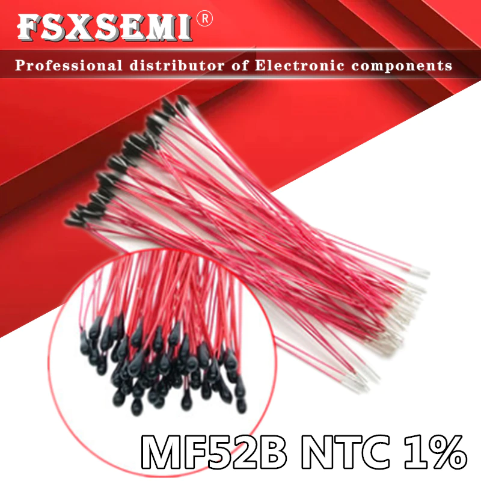

[назад к списку устройств](Список_поддерживаемых_датчиков.md)

[Калибровка NTC](Калибровка_NTC.md)

В проекте WEGABOX используется терморезистор компенсации ЕС типа NTC3950 100 кОм (при 25 градусах)

https://aliexpress.ru/item/1005001691697108.html

Можно использовать другие номиналы терморезисторов.

Важно, что при использовании номинала термистора отличающегося от 100 кОм, необходимо в схеме [WEGABOX](Схема_WEGABOX.md) заменить резистор R6 на соответствующий номиналу термистора.