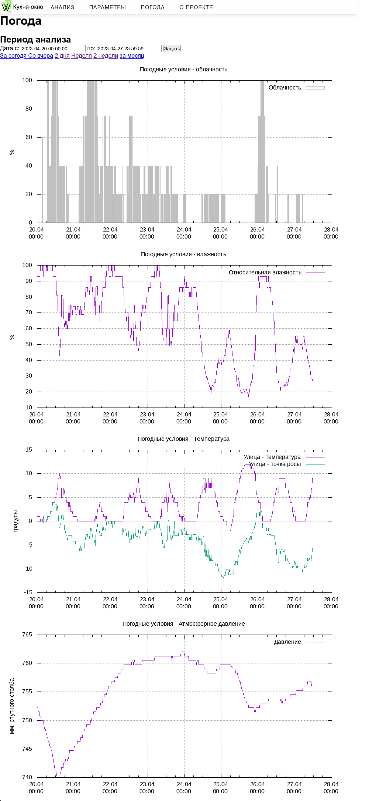

|950x950пкс]]

## Подключение погодного модуля
Он нужен для получения данных о текущей погоде и ее логирования с последующим включением в состав графиков wega.

- Регистрируемся на сервисе и создаем api ключ на этой странице: <code><nowiki>https://home.openweathermap.org/api_keys</nowiki></code>
- Найти ближайшую точку можно на карте: <code><nowiki>https://openweathermap.org/weathermap</nowiki></code>

### Установка
<code>apt install curl jq</code>

- Создадим скрипт загрузки погоды, незабыв указать свой город и ключ в поля <code>sity</code>, <code>apikey</code>

 nano /usr/bin/owm-log

- Добавим

<syntaxhighlight lang="bash" line="1">

1. !/bin/bash

sity="Khabarovsk,ru"
apikey="XXXXXXXXXXXXX"
wegaapikey="ХХХХХХХХХХХХ"

curl "http://api.openweathermap.org/data/2.5/weather?q=$sity&appid=$apikey" > /run/shm/owm
sdate=`date '+%Y-%m-%d %H:%M:%S'`
hum=`jq -r ".main.humidity" /run/shm/owm`
pressure=`jq -r ".main.pressure" /run/shm/owm`
temp=`jq -r ".main.temp" /run/shm/owm|awk -F ":" '{print $1-273.15}'`
clouds=`jq -r ".clouds.all" /run/shm/owm`

echo "$sdate;$temp;$hum;$pressure;$clouds" >> /var/log/sensors/owm.log
curl `echo "http://127.0.0.1/wega-api/wegabox.php?db=owm&auth=$wegaapikey&temp=$temp&hum=$hum&pressure=$pressure&clouds=$clouds" | sed -e s/,/./g`
</syntaxhighlight>

- Делаем скрипт исполняемым и добавляем папку для логов

 chmod +x /usr/bin/owm-log
 mkdir /var/log/sensors

- Проверяем

 owm-log
 cat /var/log/sensors/owm.log
Если все прошло успешно в файл запишется текущее состояние погоды

- Назначим выполнение загрузки погоды по расписанию
- Откроем файл

 nano /etc/crontab

- И добавим туда в конец строку

 */15 * * * * root owm-log
Раз в 15 минут файл с погодой будет пополняться.