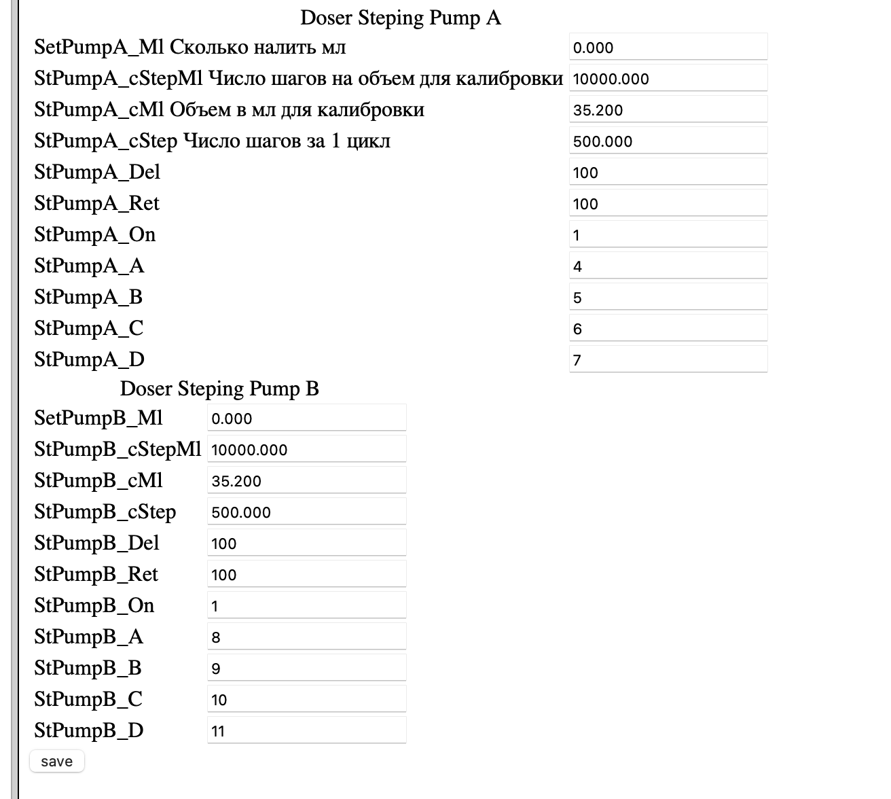

**<big>Обратите внимание что драйвер ГРЕЕТСЯ! если поставить неправильные настройки то он может перегреться и сгореть</big>**

ЧТо нужно

- плата в сборе вегабокс
- два насоса [https://aliexpress.ru/item/4000128179112.html](https://aliexpress.ru/item/4000128179112.html?spm=a2g2w.orderdetail.0.0.493c4aa6Op5NOw&sku_id=10000000374094311)
- провода
- паяльник
- шланги
- радиатор желательно [такой](https://aliexpress.ru/item/1005004623651991.html)  или [такой](https://aliexpress.ru/item/32861531579.html) - еще не опробовали но должны подойти

Настройка

# заходим в настройки и ставим флаг c_DOSER 1 и шьем плату: в плате появляются настройки дозера  +. страница калибровки его
# подключать дозер  необходимо в порты DRV2 DRV3
# делаем настройки как на рисунках ниже
# настройки помп: pwd 255 ставим
# настройки: включаем дозер
# настройки дозера: ставим параметры как на рисунке и калибруем нажав кнопку save - пойдет сразу налив того, что вы указали - цель узнать сколько нальет за 10т шагов
# желательно использовать радиаторы - достаточно будет маленького, или ставить меньшие шаги, как на картинке

1. записываем полученные мл в настройки дозера, сохраняем и проверяем указав меньшее количество в налив - например вы откалибровали на 35 мл, поставить налить 15 и посмотрите совпадут ли цифры - должны совпасть

