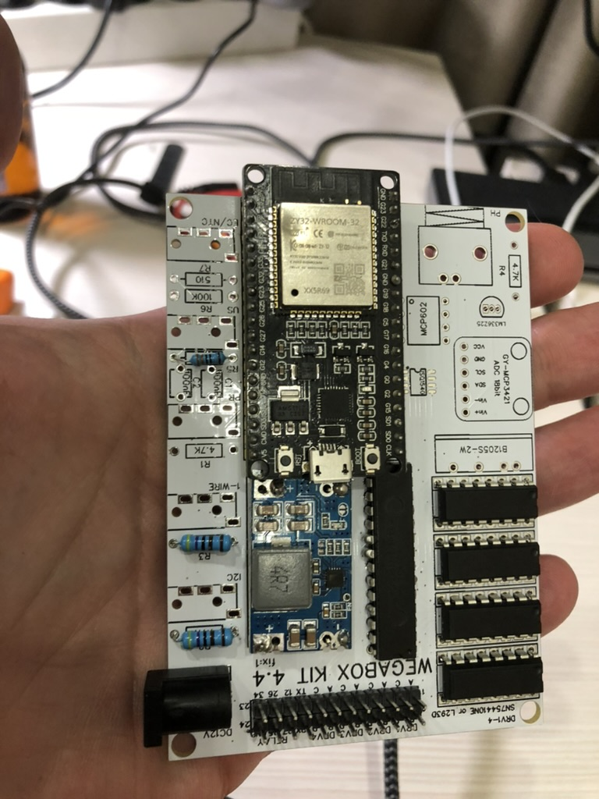

## Описание

  
  
  
  
  

WEGA-MIXER - это программное обеспечение и аппаратное обеспечение для автоматического смешивания и дозирования различных реагентов. WEGA-MIXER разработан для использования в **домашних** условиях и предоставляет возможность **автоматизированного контроля и мониторинга процесса ВЗВЕШИВАНИЯ**.

WEGA-MIXER позволяет создавать и запускать различные сценарии взвешивания/смешивания с предварительно заданными параметрами. Он также предоставляет интерфейс для мониторинга и контроля различных параметров процесса.

**Основные цели WEGA-MIXER включают повышение эффективности, точности и надежности процесса смешивания, а также сокращение времени и ресурсов человека, требуемых для создания А и Б концентратов путем взвешивания**

## Изготовление устройства
### Заказ комплектующих
На текущий момент существует 2 версии WEGA-MIXER:

# на базе ESP8266 - устаревшая, требует дополнительных усилий по сборке
# на базе ESP32  - текущая, на базе платы для WEGABOX
Ниже представлены списки комплектующих для обоих версий , однако дальнейшее описание сборки и тестирования будет только для версии на базе ESP32.

- Заказ комплектующих для ESP8266  Актуальный список комплектующих для версии на базе ESP8266 - [здесь](Список_комплектующих_для_миксера_на_базе_ESP8266.md).

- Заказ комплектующих для ESP32  Требуется заказать:
# плату, процесс  не отличается от [заказа платы для WEGABOX](Заказ_печатной_платы.md)

1. комплектующие, актуальный список - [здесь](Список_комплектующих_для_миксера_на_базе_ESP32.md).

### Заказ необязательных дополнительных компонент
- Емкости для растворенных солей  Подойдут любые бутылки. Емкость бутылок подбирается индивидуально, исходя из размеров корпуса WEGA-MIXER
- Магнитная мешалка для растворов, с подогревом. Облегчает размешивание . Пример - [здесь](https://aliexpress.ru/item/1005004549149120.html?sku_id=12000029574262245)
- Магниты для мешалки. Пример - [здесь](https://aliexpress.ru/item/1005003767875595.html?sku_id=12000027097433585)

### Изготовление контроллера
Изготовление контроллера аналогично процессу изготовления контроллера WEGABOX.
Описать нюансы

### Прошивка контроллера
Прошивка контроллера для WEGA-MIXER проходит аналогично  [прошивке контроллера для WEGABOX](Прошивка.md)

Репозитарий прошивок для WEGA-MIXER находится [здесь](https://github.com/WEGA-project/wega-mixer)

Для установки платформы [VSCODE](https://code.visualstudio.com/) и настройки работы воспользуйтесь шагами 1-3 из инструкции по [прошивке контроллера для WEGABOX](Прошивка.md)

1. Должно быть как на картинке ант - platformio + задания на компиляцию
1. Следуйте инструкциям для настройки параметров WiFi, указанным в документации проекта.
1. Подключите плату WEGA-MIXER к компьютеру по USB и прошейте ее через platformio.
1. Попробуйте войти в административную панель, однако, возможно, у вас возникнут проблемы с доступом. Если вы столкнулись с ошибкой, связанной с некалиброванными весами в основной ветке проекта, вы можете обратиться к альтернативной ветке, где данная проблема была исправлена.

### Изготовление корпуса
### Требования к сборке устройства
- Весы должны быть закреплены снизу, сверху на них должна закреплена быть плошка на которую в местах А и Б будут ставиться емкости для солей.  Весы не должны шататься. **Провод от них то платы hx711 должен быть минимальной длины, а так же заэкранирован (фольгой например).**
- Насосы лучше всего ставить не над экраном, а внизу, чтобы если что-то протечет на коротало! Выводить трубки уже в нужное место
- Насосы желательно закреплять чтобы они не дергались и не порвали шланг
- Предусмотрите в корпусе выводы под кабеля, а так же где будет плата. К плате должно быть подведено питание от адаптера, плата в свою очередь питает насосы и замеряет вес.

### Датчик веса и его калибровка
1. Проведите калибровку весов, используя известный заранее вес или легкий предмет, например, 80 граммов. Разместите его на месте А и Б.
1. В административной панели нажмите на кнопки "Calibrate" и "Tare".
1. Положите вес на место А и введите его значение в соответствующее поле в административной панели. Затем нажмите кнопку расчета, и появится расчетное значение для параметра Calibration_factor_a в прошивке.
# Повторите ту же процедуру для веса на месте Б. Введите значение и получите расчетное значение для параметра Calibration_factor_b.

1. Внесите полученные значения в прошивку в config.h и перепрошейте плату через USB или WiFi.

### Тестируем
- #Наполняем бутылки водой, стремясь достичь необходимого объема. Проверяем, чтобы вода была налита ровно в соответствии с требуемым объемом.
- #Методом проб и ошибок подбираем подходящий насос для вашей задачи и определяем, какие соли следует использовать. Обычно порядок действий аналогичен интерфейсу. Устанавливаем нужный вес, нажимаем налив, проверяем вес и записываем название соответствующей соли.
- #Если все прошло успешно, загружаем растворенные соли в миксер.
- #Радуемся результату и, если необходимо, печатаем требуемый профиль или другую соответствующую информацию.

## Растворение солей
Соли необходим растворять в том объеме в котором вы будете их использовать, но не превышая максимальную растворимость солей на объем. Для дома рекомендуется делать менее сильные концентраты  - так будет быстрее наливаться. Если у вас менее 1мл миксер рассчитал - скорее всего будет капельный налив (долгий)

## PS
Если у вас правильно выполнена калибровка и настройка, я рекомендую внести следующие изменения в прошивку, чтобы оптимизировать процесс налива: 

1. Настройка коэффициентов: Внесите изменения в значения параметров "sale_read_times" и "scale_tare_times" в прошивке. Рекомендуется установить значения от 4 до 12 в соответствии с вашими потребностями. Чем выше значение, тем более точным и длительным будет процесс налива. Однако помните, что более высокие значения могут требовать большего времени.
1. Скорость налива: Если вы хотите, чтобы процесс налива был быстрее, убедитесь, что установленный вес для насоса превышает 1 грамм. В противном случае налив будет происходить медленно по каплям, как это происходит в конце процесса.
1. Точность и размер капли: Имейте в виду, что чем меньше размер капли, тем выше точность налива. Это может быть важным фактором при настройке системы.

Внесение этих изменений в прошивку позволит вам оптимизировать процесс налива согласно вашим требованиям. Однако помните, что каждая система может иметь свои особенности, поэтому важно проводить тестирование и настройку, чтобы достичь оптимальных результатов в вашем конкретном случае.

## **ВАЖНО! Обратить внимание!**
**HX711** - это 24-битный АЦП (аналого-цифровой преобразователь), который широко используется для измерения веса с помощью различных датчиков, таких как датчики нагрузки. Если вы сталкиваетесь с проблемой нестабильных показаний HX711, вот несколько рекомендаций для стабилизации его работы: 

1. Электромагнитные помехи: Убедитесь, что HX711 и подключенные к нему компоненты не подвергаются электромагнитным помехам. Изолируйте HX711 от источников электромагнитных полей, таких как силовые кабели, мощные моторы или радиоустройства.
1. Питание: Обеспечьте стабильное и чистое питание для HX711. Используйте качественный источник питания, минимизируйте пути пропускающегося сигнала и помехи. Рекомендуется использовать отдельный источник питания или фильтры для устранения пульсаций.
1. Заземление: Правильное заземление может снизить шум и помехи. Убедитесь, что HX711 и другие компоненты имеют надлежащее заземление.
1. Подключение датчика нагрузки: Убедитесь, что датчик нагрузки правильно подключен к HX711. Проверьте соответствие схемы подключения и калибровку. Плохие соединения или неправильная калибровка могут вызывать нестабильные показания.
1. Усреднение показаний(**есть в прошивке**): Выполните усреднение нескольких последовательных измерений, чтобы снизить случайные флуктуации и улучшить стабильность.
1. Калибровка(**есть в прошивке**): Правильная калибровка HX711 может помочь устранить систематические ошибки и улучшить точность измерений. Процедура калибровки зависит от вашей конкретной конфигурации и используемого датчика нагрузки.
1. Шумовой фильтр(**есть в прошивке**): Применение цифровых или аналоговых фильтров может помочь сгладить шумы и помехи, влияющие на показания HX711.

Учитывайте, что проблемы с нестабильными показаниями HX711 могут быть вызваны не только самим HX711, но и другими факторами в вашей системе измерений.