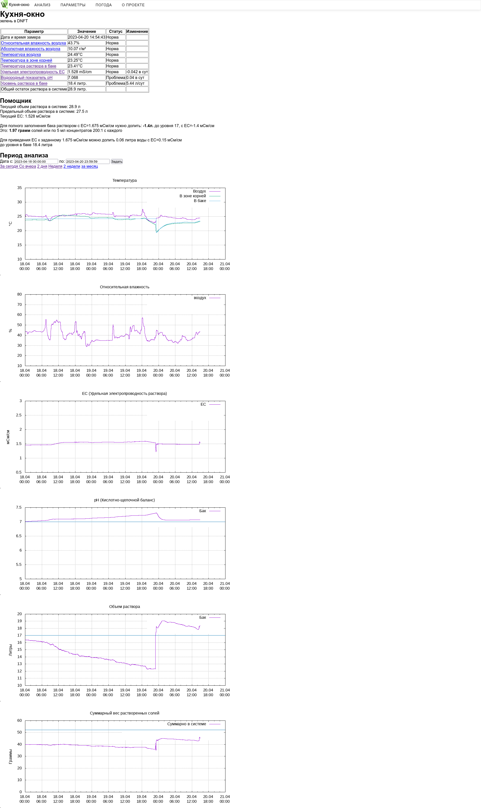

## Что такое WEGA-Server
Это WEB сервер в стандарте [LAMP](https://ru.wikipedia.org/wiki/LAMP) . Роль сервера - объединять все компоненты проекта в единое целое. Отображать графики  значений и подсказки по выращиванию, а так же выполнять калибровку датчиков.  В wega-server входят следующие компоненты:

- **[WEGA-GUI](WEGA-GUI.md)** - модуль отображения статистики измерений выдает данные по фактическому состоянию растворов
- **[WEGA-DB](WEGA-DB.md)** - хранит данные со всех сенсоров и миксера
- **[WEGA-API](WEGA-API.md)** - осуществляет прием данных и передачу параметров на устройства
- **[WEGA-EVENT](WEGA-EVENT.md)** - производит уведомление о ситуациях через **telegram bot**
- **[SYSLOG](SYSLOG.md)** - сервер сбора логов работы устройств
- **[OWM Fetcher](OWM_Fetcher.md)** - компонент получающий погоду с сервиса [Open Weather Map](https://openweathermap.org/)
- **[GRAFANA](GRAFANA.md)** - мощный и удобный компонент визуализации измерений (значения графики отчеты)

## Поддержка проекта
Страница проекта на [github.com](https://github.com/WEGA-project/wega)

Telegram канал: https://t.me/WEGA_SERVER/20740 и старый https://t.me/WEGA_SERVER/4

## Развертывание
WEGA-SERVER может быть развернут на множестве операционных систем и устройств, везде где поддерживается набор технологий LAMP но официально проектом поддерживается:

- X86_64 совместимый компьютер или виртуальная машина
- Микрокомпьютер Orange Pi Zero 2 ([подробнее](https://t.me/WEGA_SERVER/1/12532))
- любой облачный VDS сервис (AWS, GCP, Azure, Oracle) и подобный

Официально поддерживаемая операционная система **Ubuntu 20.04 LTS** ([установка](Установка_Ubuntu_20.04_LTS.md))

При соблюдении требований сервер со всеми компонентами может быть развернут автоматизированно с помощью установочного скрипта:
 sudo su
 wget -O - https://raw.githubusercontent.com/WEGA-project/wega/master/install.sh | bash 
<blockquote>
 *Внимание, замечены блокировки со стороны серверов grafana, что может приводить к проблемам автоустановки. Для обхода рекомендуется запускать скрипт через* **torsocs**
</blockquote>

<youtube>TOMY-anSX0E‎</youtube>

## Ручная установка
[Ручная установка WEGA-SERVER](Ручная_установка_WEGA-SERVER.md)