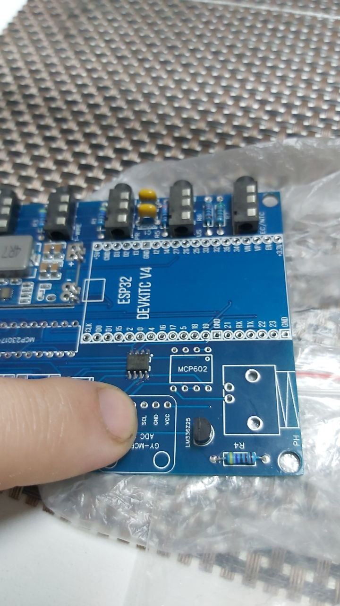
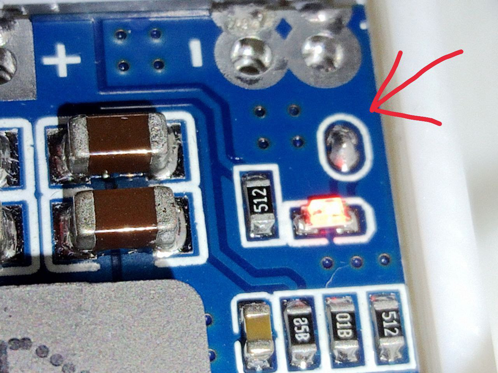

[СХЕМА ПРОЕКТА](Схема_WEGABOX.md)

[МОНТАЖНАЯ ПЛАТА](Заказ_печатной_платы.md)

[СПИСОК КОМПОНЕНТОВ](Список_компонентов_платы_WEGABOX.md)

[СПИСОК ДАТЧИКОВ](Список_поддерживаемых_датчиков.md)
[категория: WEGABOX](категория__WEGABOX.md)
## Сборка
Итак, у вас есть все нужные компоненты и плата для монтажа.

Если нет - смотрим: [заказ производства платы](Заказ_печатной_платы.md), заказ компонентов платы.

### Советы:
Обязательно стоит посмотреть видео про пайку:

<youtube>ng_PM9tNJRg</youtube>
*Соберите все необходимые компоненты вместе и сложите в какой-нибудь контейнер, убедитесь, что всего хватает
*Постарайтесь не использовать жидкие флюсы (только твердая канифоль), особенно это касается пайки MCP602 и BNC коннектора для подключения pH электрода из-за гиперчувствительности данного участка
*Паять MCP602 и BNC лучше всего прутком припоя с канифолью внутри вообще без использования флюса

### Последовательность сборки
*Перед началом работ, неплохо бы предварительно [прошить](Прошивка.md) контроллер [ESP32](ESP32.md) на подключение к вашей WiFi сети и убедиться что он работает! Напаиваем сперва все компоненты, которые паяются ([SMD](https://ru.wikipedia.org/wiki/%D0%9F%D0%BE%D0%B2%D0%B5%D1%80%D1%85%D0%BD%D0%BE%D1%81%D1%82%D0%BD%D1%8B%D0%B9_%D0%BC%D0%BE%D0%BD%D1%82%D0%B0%D0%B6) монтаж) в приклад, таких всего 2: [ISO1540DR](ISO1540DR.md) и [mini560](mini560.md)
* Расставляем резисторы и конденсаторы по позициям и слегка разгибаем их ножки с обратной стороны для лучшего прижима. Паяем
* Далее паяем гнезда (для лучшего попадания в отверстия корпуса гнезда при пайке необходимо прижимать к торцам отверстий однотипно)
* Выполняем монтаж корпусных деталей - [LM336Z-2.5](LM336Z-2.5.md), [LM336Z-2.5](LM336Z-2.5.md), [MCP602](MCP602-I_P.md), [MCP23017](MCP23017.md) , [драйверы](SN754410NE.md) или кроватки для них.
* В последнюю очередь паяем шилды сначала [MCP3421](MCP3421.md), а затем [ESP32 DEVKIT](ESP32.md). 
 **Важно!** ECP32 **должен быть поднят на ножках на максимальную высоту**, для сохранения возможности подключать USB кабель для первичной прошивки.
* 
* На модуле mini560 есть площадка, замкнув которую, можно подключить в работу индикатор подачи питания.

## Отладка