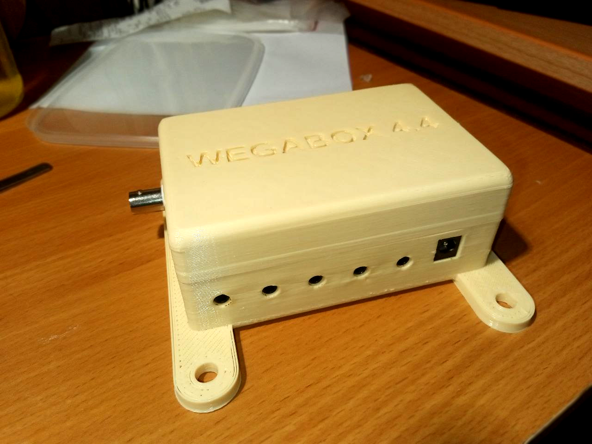

[СБОРКА](WEGABOX-KIT_Изготовление.md)

[КОМПОНЕНТЫ](Список_компонентов_платы_WEGABOX.md)

[ДАТЧИКИ](Список_поддерживаемых_датчиков.md)

[ИНТЕРФЕЙС](ИНТЕРФЕЙС.md)

## Описание

- **WEGABOX** – это контроллер, предназначенный для помощи в выращивании растений на гидропонных установках замкнутого цикла. Ниже кратко перечислен имеющийся функционал
  - Мониторинг ЕС
  - Мониторинг pH
  - Мониторинг Температуры воздуха и раствора(в баке и в корневой зоне)
  - Мониторинг Влажности воздуха
  - Мониторинг Атмосферного давления
  - Мониторинг СО2
  - Мониторинг Освещенности
  - Мониторинг Уровня раствора в литрах
  - Управление корневым давление(на сколько это возможно)
  - Поддержание заданного ЕС в рабочем баке
- Начиная с версии контроллера 4.4 может управлять напрямую до 16 штуками 12-вольтовых устройств. Контроллер позволяет управлять скоростью насосов и логикой, направленной на снижение корневого давления, подавать и отключать циркуляцию раствора и стабилизировать значение ЕС, подавая воду насосом или клапаном высокого давления. Кроме того, контроллер обладает функцией дозирования удобрений с помощью шаговых насосов проекта [WEGA-DOSER](WEGA-DOSER.md).
- Контроллер разработан таким образом, чтобы любой человек с базовыми навыками в пайке мог собрать его. **WEGABOX-KIT** похож на конструктор для новичка-радиолюбителя, все детали можно заказать в готовом виде, включая монтажную плату, и лишь спаять все это вместе. Корпуса для контроллера и датчиков могут быть распечатаны на 3D принтере в большинстве форматов OPENSCAD для удобства модификации под свои индивидуальные потребности.<blockquote>Проект условно делится на **WEGABOX** **4.x KIT** (полностью ручная сборка на корпусных компонентах/шилдах) и **WEGABOX 5.х** (заводская сборка на smd компонентах)  Подробнее о **WEGABOX** **5.х**: [Заводское производство](WEGABOX_(Заводское_производство).md).</blockquote>**WEGABOX** не самостоятельное устройство и работает в связке с [WEGA-SERVER](WEGA-SERVER.md) , который собирает и обрабатывает данные с множества устройств и объединяет в рамках всего проекта [WEGA](Заглавная_страница#ПРОЕКТ_WEGA.md)

## Ссылки на ресурсы проекта
Проект на [github](https://github.com/WEGA-project/wegabox)

Проект на [OSHWLab](https://oshwlab.com/siv237/esp32wega4-2_copy_copy_copy)

Telegram: [активный канал](https://t.me/WEGA_SERVER/20742), [старый канал](https://t.me/esp32wega)

Библиотека 3D моделей корпусов и креплений для печати на 3D-принтере [github](https://github.com/WEGA-project/wega-3d)

## С чего начать
Прежде всего нужно оценить свои собственные навыки которые должны включать в себя: 

- Минимальные знания в электронике (знать что такое <code>+</code> или <code>GND</code>)
- Умение читать принципиальную схему, и находить контрольные места на монтажной плате при обращении за помощью
- Знание, что такое паяльник и как с ним работать
- Умение собирать компоненты по схеме
- Минимальные знания в программировании (в нужных местах в коде проекта указать свои параметры)

Если, всего выше перечисленного или одного из выше перечисленного не знаешь, не умеешь, не понимаешь, то этому можно научиться в процессе. Главное желание и упорство. Есть множество успешных примеров того, как люди в процессе сборки получали нужные навыки, тем более цена ошибок не высока.

Если все-же совсем нет никакого желания делать самому, можно обратиться в нашу [ярмарку](https://t.me/WEGA_SERVER/38166) и найти того, кто предложит готовые варианты.
----

## Изготовление устройства
### Заказ комплектующих
Контроллер [WEGABOX](WEGABOX.md) состоит из платы, модулей платы и датчиков.

- Проект [WEGABOX](WEGABOX-KIT_Изготовление.md) может быть собран как на универсальной монтажной плате, так и на специально изготовленной на заводе печатной плате проекта. см. [Заказ печатной платы](Заказ_печатной_платы.md).
- Контроллер изготавливается путем монтажа на него всех необходимых компонентов с помощью пайки. Они обычно приобретаются на интернет площадках таких как aliexpress или в местных радио/ардуино магазинах. см [Список компонентов платы WEGABOX](Список_компонентов_платы_WEGABOX.md)
- Помимо контроллера для WEGABOX нужны датчики. Они так-же доступны для заказа на торговых площадках и при этом имеется выбор, так как для одной задачи поддерживаются разные датчики и можно выбрать см. [Список поддерживаемых датчиков](Список_поддерживаемых_датчиков.md)
- Кроме того для датчиков и самого контроллера можно распечатать на 3D принтере нужные корпуса и крепления [Библиотека 3D](Библиотека_3D.md)

### Изготовление контроллера
Изготовление контроллера [WEGABOX-KIT](WEGABOX-KIT.md)

Схема контроллера [Схема WEGABOX](Схема_WEGABOX.md)

### Прошивка
- После успешной сборки необходимо выполнить первую прошивку проводом USB. Это нужно первый раз и требуется для указания параметров точки доступа. Дальнейшие прошивки и обновления будут выполнятся через WiFi.
- На момент прошивки у вас уже должен быть развернут и настроен [WEGA-SERVER](WEGA-SERVER.md), и сгенерированы ключи доступа.
- Установлена платформа [VSCODE](https://code.visualstudio.com/), и подключен проект из [репозитория](https://github.com/WEGA-project/wegabox)

[подробнее](Прошивка.md)

### Изготовление датчиков
### Изготовление корпуса