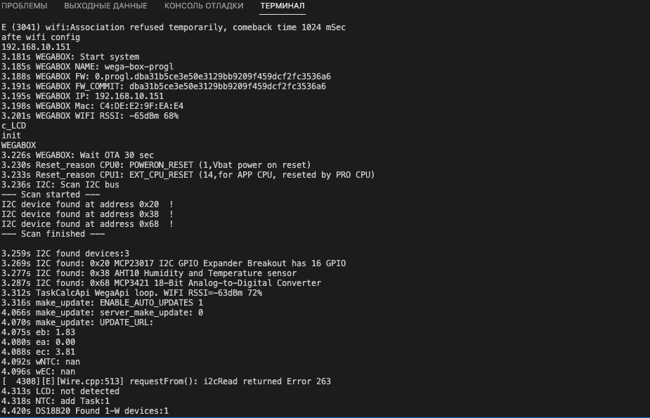

  
  
  

**На плате <big>SW2</big> это кнопка BOOT <big>SW1</big> это кнопка RESET**

## Прошивка

##### Прошивка через usb-ttl(usb-uart)
драйвер качаем отсюда https://www.silabs.com/developers/usb-to-uart-bridge-vcp-drivers

для прошивки обязательно нужен переходник usb-ttl - например такой [Модуль CP2102 от USB к TTL](https://aliexpress.ru/item/1005005180603292.html?spm=a2g2w.productlist.0.0.1bea4aa6uL0Lgp&sku_id=12000031995504947) а так же кабеля для подключения к плате

Подключение происходит GND=>GND, TX=>RX, RX=>TX<gallery>
Файл:Usb-ttl3.jpg
Файл:Usb-ttl-2.jpg
</gallery>Далее выбираем нужный порт в программе которой прошиваем, нажимаем прошить, зажимаем SW2 нажимаем SW1 и отпускаем, SW2 держим пока не пойдет процесс прошивки - на скриншоте это момент когда видим следующие строки

Serial port /dev/cu.usbserial-0001

Connecting......................

Конец прошивки до нажатия выглядит так

**По окончании прошивки жмем SW1**

после нажатия sw1 пошла прошивка грузиться и работать устройство

Если вы все сделали правильно - увидите логи в терминале.

Настройка прошивки отдельная статься