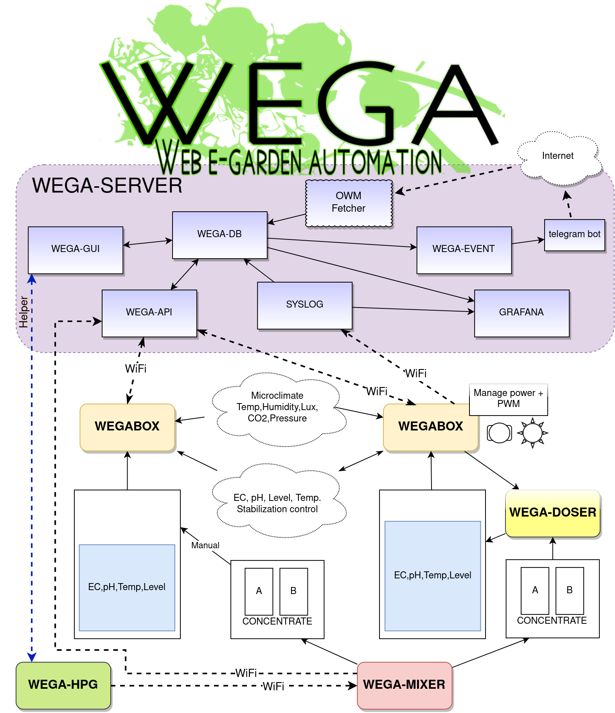

# ПРОЕКТ WEGA

**Проект `WEGA (Web E-Garden Automation)` — это экосистема, объединяющая программно-аппаратные средства, цель которой — контролировать и помогать выращивать растения на гидропонике.**

Основная идея проекта — разработка простых, самостоятельных элементов, облегчающих выращивание растений, при этом умеющих работать вместе в едином информационном взаимодействии.

Проект является открытым как в программной, так и аппаратной части и доступен на [https://github.com/WEGA-project](https://github.com/WEGA-project)

Кредо проекта: Мы стремимся создать систему контроля выращивания растений методом гидропоники, которую любой человек сможет создать самостоятельно, даже без опыта в этой области.

У проекта есть группа в Telegram: [https://t.me/WEGA_SERVER](https://t.me/WEGA_SERVER) с активным сообществом увлеченных людей.

## ОПИСАНИЕ ПРОЕКТА

### [WEGA-SERVER](wega-server.md)

Это WEB сервер в стандарте [LAMP](https://ru.wikipedia.org/wiki/LAMP). Роль сервера - объединять все компоненты проекта в единое целое. Отображать графики значений и подсказки по выращиванию, а так же выполнять калибровку датчиков. В wega-server входят следующие компоненты:
*   **[WEGA-GUI](wega-gui.md)** - модуль отображения статистики измерений выдает данные по фактическому состоянию растворов
*   **[WEGA-DB](wega-db.md)** - хранит данные со всех сенсоров и миксера
*   **[WEGA-API](wega-api.md)** - осуществляет прием данных и передачу параметров на устройства
*   **[WEGA-EVENT](wega-event.md)** - производит уведомление о ситуациях через **telegram bot**
*   **[SYSLOG](syslog.md)** - сервер сбора логов работы устройств
*   **[OWM Fetcher](owm-fetcher.md)** - компонент получающий погоду с сервиса [Open Weather Map](https://openweathermap.org/)
*   **[GRAFANA](grafana.md)** - мощный и удобный компонент визуализации измерений (значения графики отчеты)

[Подробнее о WEGA-SERVER](wega-server.md)

### [WEGABOX](wega-box.md)

[СБОРКА](wegabox-kit.md), [КОМПОНЕНТЫ](wegabox-components.md), [ДАТЧИКИ](wegabox-sensors.md), [ИНТЕРФЕЙС](wegabox-interface.md)

Это система, которая помогает следить за состоянием гидропонных систем, используемых для выращивания растений. Она измеряет параметры окружающей среды, а также состояние рабочего раствора, который используется для выращивания растений. Система управляет циркуляцией воды и добавлением удобрений, чтобы растения росли здоровыми и сильными.

[Подробнее о WEGABOX](wega-box.md)

### [WEGA-DOSER](wega-doser.md)

Это устройство состоящее из двух высокоточных шаговых насосов выполняющих подачу концентратов жидких удобрений в бак с рабочим раствором, что позволяет поддерживать профиль расчетный питания. WEGA-DOSER подключается непосредственно контроллеру WEGABOX

[Подробнее о WEGA-DOSER](wega-doser.md)

### [WEGA-MIXER](wega-mixer.md)

Это устройство, которое помогает изготовить смеси из солей (концентраты A и B), которые можно использовать для создания рабочих растворов. Эти смеси создаются в определенных пропорциях, чтобы гарантировать их химическую совместимость и профиль питания, а так же удобство в использовании и хранении. Получает параметры изготовления от калькулятора WEGA-HPG.

[Подробнее о WEGA-MIXER](wega-mixer.md)

### [WEGA-HPG](wega-hpg.md)

WEGA-HPG - калькулятор для изготовления удобрений из простых солей с поддержкой множества платформ (Windows, Linux, Mac) . Он позволяет проводить расчеты для создания рабочих растворов, в том числе учитывая данные от WEGA-SERVER и управлять устройством WEGA-MIXER для создания смесей.

[Подробнее о WEGA-HPG](wega-hpg.md)
