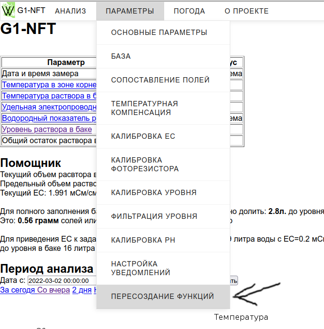

# WEGA-DB

## Описание

- Представляет собой систему баз, развернутых на MySQL-сервере.
- Архитектурно каждому устройству соответствует своя база данных.
- Каждая база содержит таблицу измерений и таблицы конфигурации и калибровок устройства.
- Разные устройства могут использовать разные базы в рамках единого сервера, например `WEGA-MIXER` имеет свой набор параметров.
- Компоненты `SYSLOG` и `OWM Fetcher` также хранят данные в едином сервере, а `WEGA-GUI` и `GRAFANA` используют их при анализе измерений и построении графиков.

## Обслуживание

Так как все параметры устройства хранятся в одной базе, перенос, очистка, архивирование и восстановление выполняются очень просто.

### Архивирование, перенос и восстановление базы устройства

Процедура снятия дампа базы и последующего восстановления полезна, если нужно:

- Развернуть копию базы на том же сервере, зафиксировав состояние прошлых периодов.
- Создать резервную копию на случай сбоев и хранить архив отдельно.
- Перенести данные на новый сервер.

## Что потребуется

- Доступ в консоль сервера (например, по SSH).
- Пароль пользователя `root` для MySQL (можно посмотреть в `db.php`).

```bash
cat /var/WEGA/db.php
```

## Backup

Снятие дампа (бэкапа) базы:

```bash
mysqldump -uroot -p esp32wega > esp32wega_dump.sql
```

Где `esp32wega` — имя базы, а `esp32wega_dump.sql` — имя файла архива.

Перенос архива на другой сервер:

```bash
rsync -P esp32wega_dump.sql root@11.12.13.14:/tmp
```

- `root` — пользователь SSH на удалённом сервере.
- `11.12.13.14` — адрес удалённого сервера.
- `/tmp` — путь на удалённом сервере, куда заливается архив.

## Restore

Рассмотрим перенос базы на новый сервер с другим именем (например, `lemon`).

1. Подключаемся по SSH к новому серверу.
2. Создаём чистую базу (предварительно удалив при наличии):

   ```bash
   mysql -uroot -p -e "drop database lemon"
   mysql -uroot -p -e "create database lemon"
   ```

3. Заливаем дамп в новую базу:

   ```bash
   mysql -uroot -p --one-database lemon < /tmp/esp32wega_dump.sql
   ```

4. Создаём конфигурационный файл для `WEGA-GUI`:

   ```bash
   nano /var/WEGA/wegagui/config/lemon.conf.php
   ```

   Содержимое файла:

   ```php
   <?php
   include "../../db.php";
   $my_db = "lemon";
   $tb = "sens";
   ?>
   ```

После восстановления, возможно, потребуется выполнить пересоздание функций из интерфейса `WEGA-GUI`.


