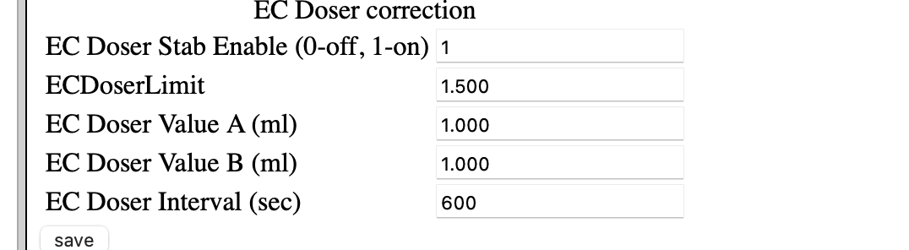
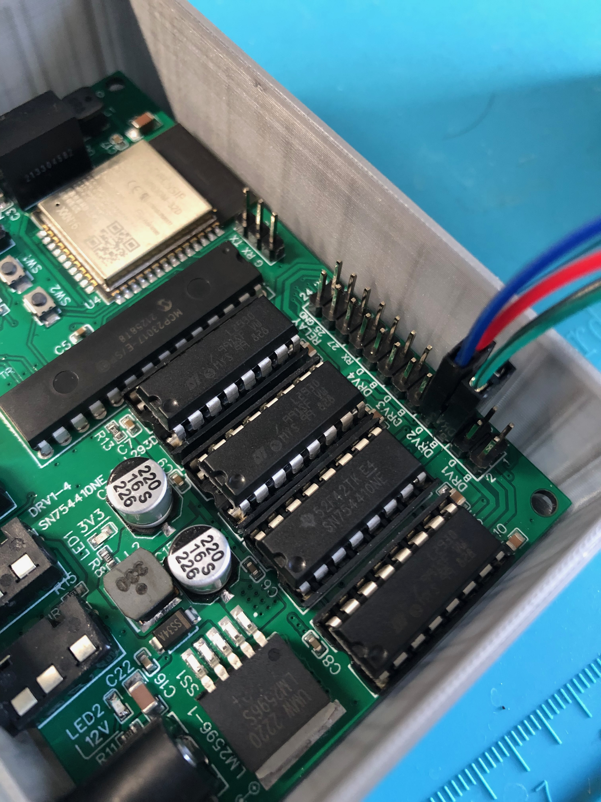

**<big>Обратите внимание что драйвер ГРЕЕТСЯ! если поставить неправильные настройки то он может перегреться и сгореть</big>**

Что нужно:

*   плата в сборе вегабокс
*   два насоса [https://aliexpress.ru/item/4000128179112.html](https://aliexpress.ru/item/4000128179112.html?spm=a2g2w.orderdetail.0.0.493c4aa6Op5NOw&sku_id=10000000374094311)
*   провода
*   паяльник
*   шланги
*   радиатор желательно [такой](https://aliexpress.ru/item/1005004623651991.html) или [такой](https://aliexpress.ru/item/32861531579.html) - еще не опробовали но должны подойти

## Настройка

1.  заходим в настройки и ставим флаг `c_DOSER 1` и шьем плату: в плате появляются настройки дозера +. страница калибровки его
2.  подключать дозер необходимо в порты `DRV2` `DRV3`
3.  делаем настройки как на рисунках ниже
4.  настройки помп: `pwd 255` ставим
5.  настройки: включаем дозер
6.  настройки дозера: ставим параметры как на рисунке и калибруем нажав кнопку `save` - пойдет сразу налив того, что вы указали - цель узнать сколько нальет за 10т шагов
7.  желательно использовать радиаторы - достаточно будет маленького, или ставить меньшие шаги, как на картинке
8.  записываем полученные мл в настройки дозера, сохраняем и проверяем указав меньшее количество в налив - например вы откалибровали на 35 мл, поставить налить 15 и посмотрите совпадут ли цифры - должны совпасть

