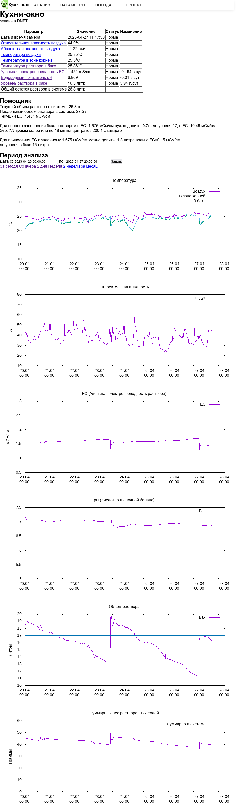

# WEGA-GUI

## Описание

`WEGA-GUI` — основной компонент `WEGA-SERVER`. Это графический интерфейс для отображения и настройки параметров, демонстрации графиков и уведомлений о состоянии устройств.

Каждому устройству сбора, такому как `WEGABOX`, соответствует один конфигурационный файл в папке (см. оригинальную wiki для полного пути).
