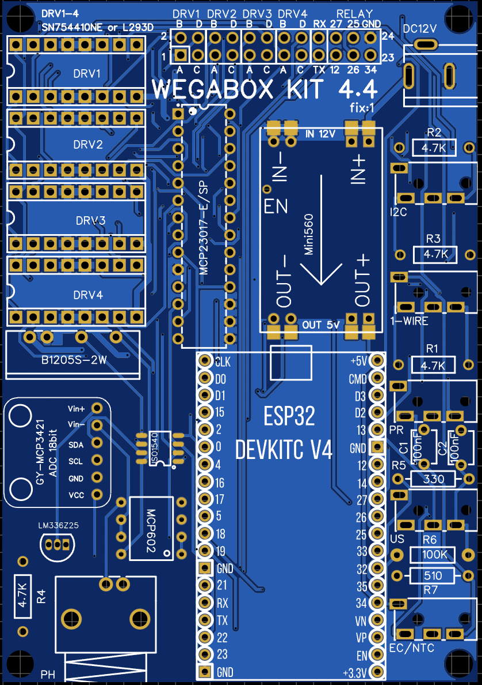

Для простоты сборки <code>WEGABOX</code> была разработана монтажная плата, которую можно заказать и собрать на любом заводе.

Выбрать завод можно тут: https://pcbshopper.com/. Плата с двухслойная, 70 мм х 100 мм

Так-же можно найти производителя на Aliexpress [https://aliexpress.ru/wholesale?SearchText=%D0%B8%D0%B7%D0%B3%D0%BE%D1%82%D0%BE%D0%B2%D0%BB%D0%B5%D0%BD%D0%B8%D0%B5+%D0%BF%D0%BB%D0%B0%D1%82+pcb](https://aliexpress.ru/wholesale?SearchText=%D0%B8%D0%B7%D0%B3%D0%BE%D1%82%D0%BE%D0%B2%D0%BB%D0%B5%D0%BD%D0%B8%D0%B5+%D0%BF%D0%BB%D0%B0%D1%82+pcb) или спросить на "[Ярмарке](https://t.me/WEGA_SERVER/38166)" нашей группы в Telegram. 

Проверенные производители с сервисом изготовления плат:

- https://jlcpcb.com
- https://allpcb.com
- https://www.pcbway.com

Вам понадобится гербер файл: [Gerber WEGABOX 4.4 fix1.zip](_файл_Gerber_WEGABOX_4.4_fix1.zip.md)

Данный файл загружается в сервис изготовления платы, выбираете цвет и число (обычно не менее 5 штук) и оплачиваете ожидаете получения. Цена набора с из 5 штук примерно 600-800 рублей с доставкой по России т.е. чуть более 100 рублей за платку.<blockquote>Советую использовать белый цвет платы. Это позволяет визуально оценить качество пайки в самом ответственном месте в котором расположен операционный усилитель [MCP602](MCP602.md)</blockquote>