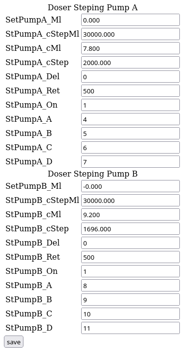
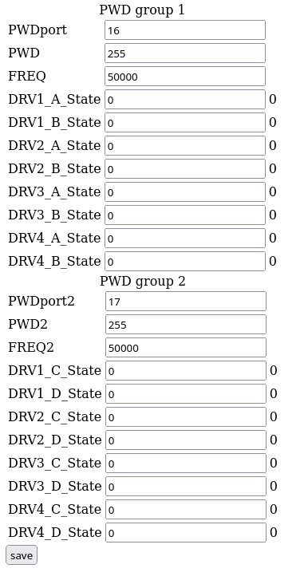
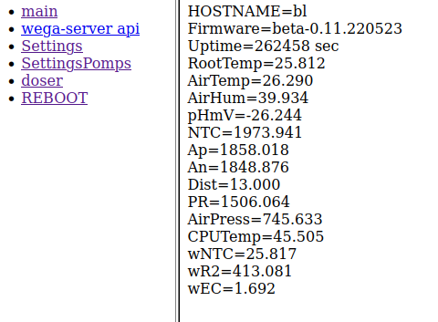
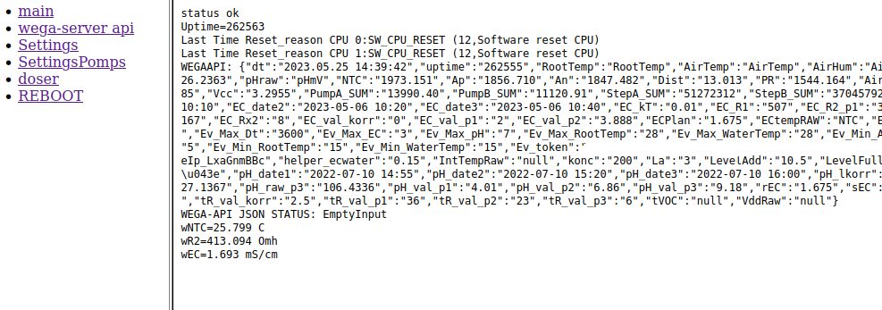
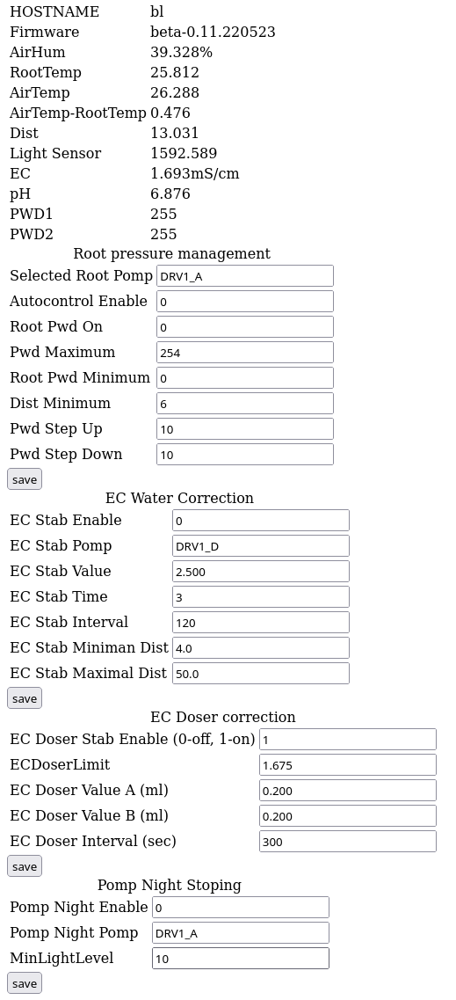

После успешной [прошивки](Прошивка.md) [WEGABOX](WEGABOX.md) подключается к точке WiFi доступа и к нему становится возможно подключиться по WEB интерфейсу.

Для этого в браузере подключаемся к адресу http://wegabox.local где **wegabox** - это имя конкретного устройства заданное в файле **pre.h** перед выполнением прошивки.
 *в примере ниже: <nowiki>http://bl.local</nowiki>*

## **main**: Окно диагностики устройств

При подключении к web интерфейсу контроллера сразу про можно проверить, какие устройства обнаружились и посмотреть параметры версии прошивки и времени работы.

## **wega-server api**: Контроль обмена с api [WEGA-SERVER](WEGA-SERVER.md)
В данном окне проверяется успешность получения калибровочных и служебных данных от сервера. Они нужны для вычисления базовых значений таких как EC, pH и температура NTC на стороне контроллера, а так же получение уставок и порогов значений сработки исполнительных устройств.

## **Settings**: настройки триггеров
Триггеры - это элементы системы управления [WEGABOX](WEGABOX.md) , которые активируются автоматически при определенном событии или изменении значений в получаемых от [датчиков](Список_поддерживаемых_датчиков.md) данных. Это позволяет автоматизировать процессы выращивания растений за счет того, что контроллер включает/выключает, а так же регулирует работу различных механизмов, таких как насосы, реле, клапаны и дозер.
 Окно настройки триггеров делится на модули

### Root pressure management
 Модуль управления корневым давлением
Данный модуль реализует в системах с циркуляцией раствора принцип снижения вероятности резкого перепада температур между корневой зоной и листьями.

- **Selected Root Pomp**: Указываем имя контакта к которому подключена помпа напрмиер DRV1_A

- **Autocontrol Enable**: Включение выключение модуля. 0 - выключено, 1 - включено
- **Root Pwd On**: Включение плавного регулирования оборотами помпы с помощью [ШИМ](https://ru.wikipedia.org/wiki/%D0%A8%D0%B8%D1%80%D0%BE%D1%82%D0%BD%D0%BE-%D0%B8%D0%BC%D0%BF%D1%83%D0%BB%D1%8C%D1%81%D0%BD%D0%B0%D1%8F_%D0%BC%D0%BE%D0%B4%D1%83%D0%BB%D1%8F%D1%86%D0%B8%D1%8F) 0 - выключено, 1 включено
- **Pwd Maximum**: Предельное значение оборотов помпы выше которого помпа не будет разгонятся, максимум 255
- **Root Pwd Minimum**: Минимальное значение оборотов помпы ниже которого ШИМ не будет снижаться
- **Dist Minimum**: Минимальное расстояние от датчика до раствора в баке. При выключении помпы циркуляции часть раствора может возвращаться в бак и если там недостаточно места может происходить перелив через край. Задавая этот параметр в сантиметрах вы предотвращаете отключение циркуляции при слишком высоком уровне в баке
- **Pwd Step Up**: значение шага для шим при увеличении скорости циркуляции
- **Pwd Step Down**:  значение шага для шим при уменьшении скорости циркуляции

### EC Water Correction
 Модуль автоматической коррекции ЕС разбавлением водой
Этот модуль отвечает за работу клапана или насоса подачи чистой воды в рабочий бак для разбавления раствора в случае, если его ЕС превышает заданный предел. 

- **EC Stab Enable:** Включение выключение модуля. 0 - выключено, 1 - включено

- **EC Stab Pomp:** Имя гнезда управления клапаном или насосом подачи воды, например DRV1_D
- **EC Stab Value:** Значение порога ЕС выше которого начинается срабатывание системы разбавления раствора
- **EC Stab Time:** Значение в секундах продолжительности подачи воды. Ограничивает разовую порцию воды для предотвращения избыточного разбавления.
- **EC Stab Interval:** Минимальный интервал в секундах между циклами подачи воды. Регулируется для того, чтобы дать раствору перемешаться и датчику ЕС показать реальные значения.
- **EC Stab Miniman Dist:** Минимальное значение в сантиметрах от датчика до поверхности воды в баке. Предотвращает срабатывание доливки воды в переполненный бак
- **EC Stab Maximal Dist:** Максимальное значение в сантиметрах от датчика до поверхности воды в баке. Доливает воду в бак несмотря на показания ЕС, поддерживая минимальный запас воды в баке.

### EC Doser correction
 Модуль автоматической коррекции  ЕС внесением удобрений
Этот модуль отвечает за отправку заданий для [WEGA-DOSER](WEGA-DOSER.md) на подачу удобрений в бак тогда, когда ЕС ниже заданного порога, например при разбавлении водой.

- **EC Doser Stab Enable:** Включение выключение модуля. 0 - выключено, 1 - включено
- **EC DoserLimit:** Пороговое значение ЕС до которого модуль пытается его поднять
- **EC Doser Value A:** Значение одиночной порции в (мл) подающейся насосом А
- **EC Doser Value B:** Значение одиночной порции в (мл) подающейся насосом B
- **EC Doser Interval:** Минимальное время в секундах между подачей новой порции удобрений. Необходимо для перемешивания.

### Pomp Night Stoping
 Модуль отключения циркуляции раствора в темноте

- **Pomp Night Enable:** Включение выключение модуля. 0 - выключено, 1 - включено
- **Pomp Night Pomp:** Указываем имя контакта к которому подключена помпа напрмиер DRV1_A
- **MinLightLevel:** Указываем минимальный уровень освещенности с датчика освещенности ниже которого помпа отключится