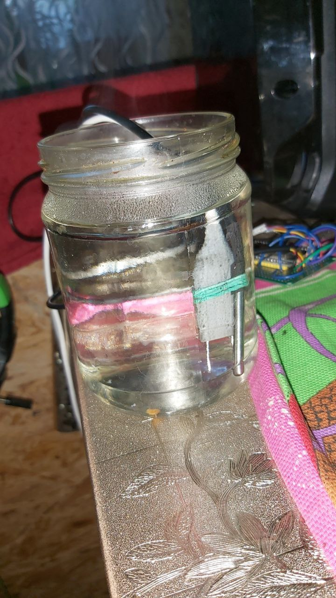
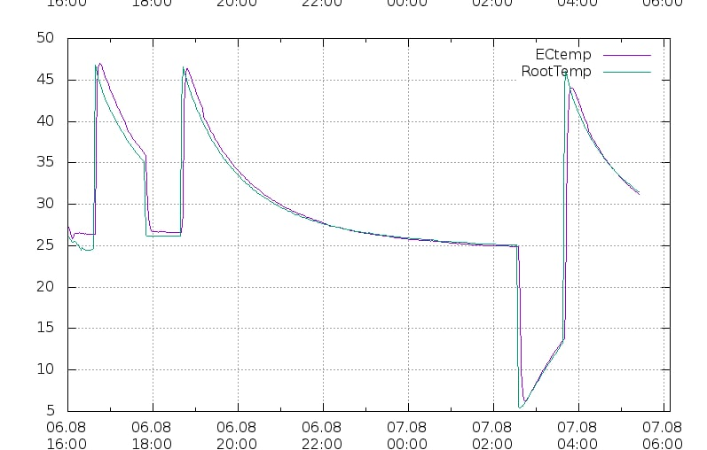

Перейти в [Калибровка ЕС](Калибровка_ЕС.md)

### Что такое NTC
*NTC* термисторы – полупроводниковый прибор, электрическое сопротивление которого изменяется в зависимости от температуры. Термистор размещается в корпусе ЕС электрода максимально близко к самим электродам. Это важно для правильной роботы термокомпенсации. Правильная работа термокомпенсации ЕС это полное исключение влияния температуры раствора на показания кондуктометра ЕС, что исключает ошибочные действия по коррекции ЕС вызванные температурным скачками ночью и днем.

Покупка [NTC](NTC.md)

### Что потребуется
Калибровка NTC выполняется по показаниям датчика DS18B20. Электрод ЕС и датчик необходимо соединить вместе (например резинкой) и опустить вместе в емкость с горячей, а затем холодной водой. 

Емкость должна остывать и нагреваться как можно медленнее для лучшей точности сведения (можно обмотать емкость с водой полотенцем).

### Как настраивать
Настраивать нужно по графикам на [WEGA-SERVER](WEGA-SERVER.md) в разделе ПАРАМЕТРЫ -> ТЕМПЕРАТУРНАЯ КОМПЕНСАЦИЯ

Необходимо добиться того, чтобы значения измеренные цифровым датчиком [DS18B20](DS18B20.md) совпадали как при высокой так и низкой температуре. Это можно добиться путем регулирования параметров:

**tR_val_korr** и **tR_B** 

Далее наблюдаем за графиками по мере нагрева или остывания воды.

