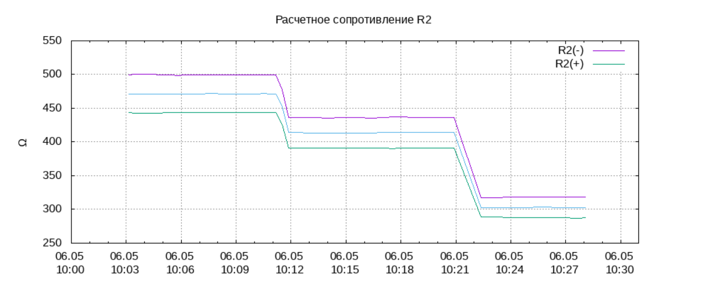

Калибровка ЕС выполняется на стороне [WEGA-SERVER](WEGA-SERVER.md) в разделе *ПАРАМЕТРЫ / КАЛИБРОВКА ЕС*

## Что необходимо
Перед калибровкой ЕС нам понадобится:

- Иметь запущенный и настроенный [WEGA-SERVER](WEGA-SERVER.md)
- [Изготовить](Электрод_ЕС_NTC.md) электрод и подключить его к [WEGABOX](WEGABOX.md)
- [Откалибровать](Калибровка_NTC.md) датчик термокомпенсации
- [Изготовить](Калибровочные_растворы_для_EC.md) калибровочные растворы (минимум 2), но лучше три и более для разных значений ЕС от минимальных до максимально возможных в гидропонике

## Выполнение калибровки
### Краткое описание процесса
- Запускаем WEGABOX в работу и проверяем в [WEGA-SERVER](WEGA-SERVER.md) что данные поступают в базу (ПАРАМЕТРЫ->БАЗА)
- [Сопоставляем](Сопоставление_полей_в_базе_данных_WEGABOX.md) поля в базе данных

- Помещаем электрод на некоторое время в разные калибровочные растворы
- Сводим расчетные сопротивления R2 в единую линию
- Устанавливаем даты и время контрольных точек
- Задаем 2 точки калибровки (какое значение R2 соответствует заданному ЕС)
- Через некоторое время (5-10 дней) уточняем значение коэффициента термокомпенсации

<blockquote>Процесс калибровки может происходить постфактум по данным накопленным в базе и может быть выполнен в любое время позднее, а не только в момент самого физического процесса</blockquote>

### Работа с электродом
Перед помещением электрода в калибровочный раствор желательно снять верхний чехол, контакты из игл протереть салфеткой с ортофосфорной кислотой для снятия окисла. Затем промыть его дистиллятом и по возможности просушить. Это нужно для того, чтобы снизить влияние остатков жидкости на поверхности на реальный ЕС калибровочного раствора.

Помещаем подготовленный электрод в первый раствор (обычно с низким ЕС), хорошенько перемешиваем и оставляем на некоторое время. <blockquote>Для того, чтобы  понять, когда можно перейти к калибровке следующей точки, смотрим на график, дожидаясь времени стабилизации измерений. </blockquote>
Повторяем процесс для всех калибровочных растворов

### Сведение расчетного сопротивления R2
В этой части необходимо, управляя коэффициентами EC_Rx1, EC_Rx2 свести все линии сопротивления R2 за период калибровки на графике "Расчетное сопротивление R2" в одну единую линию, а в графике погрешности поляризации добиться расхождений в пределах не выше 1-2%  

Тут регулируем:  

- **EC_Rx1** и **EC_Rx2** - это значения связанные с внутренней схемотехникой измерительного контура контроллера выраженных в виде влияния их на сопротивление контура измерения в разных фазах полярности. Их и нужно подбирать вручную или воспользоваться инструментом "**Расчет значений Rx1 и Rx2**"
- **EC_R1** - это значение сопротивления резистора делителя в измерительном контуре ЕС, см: [Схема WEGABOX](Схема_WEGABOX.md)
 
<blockquote>EC_R1 это значение резистора R7 на схеме. Его номинал 510 Ом. Его номинал подобран таким образом, чтобы при измерении раствора с ЕС=2 мСм/см электродом используемой конструкции, значения RAW АЦП, измеренные при разных фазах полярности сходились или были максимально близки по значению, что дает в этом месте наивысшую точность определения сопротивления [измерительным делителем напряжения](https://ru.wikipedia.org/wiki/%D0%94%D0%B5%D0%BB%D0%B8%D1%82%D0%B5%D0%BB%D1%8C_%D0%BD%D0%B0%D0%BF%D1%80%D1%8F%D0%B6%D0%B5%D0%BD%D0%B8%D1%8F)</blockquote>

- **Dr** - значение максимальной дискретизации аналогового преобразователя контроллера и равно числу 2 в степени битности АЦП <math>2^{12} = 4096</math> (В ESP32 12 битный АЦП)

#### Выполняем сведение по графикам:

<blockquote>Краткая теория:   

Измерение сопротивления раствора с помощью пропускания электрического тока через него вызывает некоторые проблемы. При постоянном токе на электродах начинается процессы электролиза которые разрушают электроды и ухудшают контакт. Потому при измерении сопротивления важно постоянно менять полярность с высокой частотой в десятки кГц.   

Кроме того на электроды действует гальванический эффект. Он вызывает выработку на электродах дополнительной составляющей которая для одной из фаз измерения добавляет сопротивление, а для другой снижает. Для того, чтобы заменить данный эффект и свести его к нулю необходимо выполнять измерения в разной полярности. Среднее значение и будет истинным значением.   

Так же измерение в разных полярностях позволяет свести электромагнитные наводки к минимуму. Это происходит за счет того, что помехи наводятся в обоих проводах одновременно и измеряя среднее в разных полярностях значения наводок становятся взаимно противоположны и обнуляют друг друга. Это значительно повышает помехоустойчивость и точность измерений.  </blockquote>

### Установка контрольных точек
Контрольные точки представляют из себя сохраненные значение даты и времени с описанием того, в каком калибровочном растворе лежал электрод в это время и позволяющие оценить правильность работы расчетной модели калибровки и проверить качество самих калибровочных растворов.

Заполняем даты для **EC_date1, EC_date2, EC_date3**

##### как это настраивается
- Мы положили электрод в калибровочный раствор с ЕС = 3.888 мСм/см изготовленный путем растворения 2 грамма пищевой соли в литре воды  и примерно 10:30 значения стабилизировались
- Задаем дату и время момента, когда значение максимально стабилизировалось и узнаем значение R2 в этот момент, которое нам далее потребуется для калибровки ЕС.
- Повторяем для всех трех калибровочных растворов.

 При указании времени контрольной точки происходит определение расчетного значения R2 и ЕС в этот момент.
<blockquote>
Контрольные точки 

- показывают правильность калибровки, и демонстрируют то насколько ожидание отличается от реальности. Если изменить параметры, то контрольные точки покажут расхождение.
- позволяют оценить, как давно выполнялась калибровка
- позволяют более точно задавать значения R2 с учетом изменений температурной компенсации а так же проверить верность изготовления самих калибровочных растворов.

Так как калибровка осуществляется по двум точкам, а калибровочных растворов обычно 3 мы можем оценить, насколько верно изготовлены эти растворы. Если все контрольные точки сходятся то и растворы приготовлены верно и <u>качеству измерений можно доверять</u>.</blockquote>
 *Надо понимать, что всегда можно идеально свести две точки на любых двух неправильных растворах но не 3 сразу!*

### Установка точек калибровки EC
Калибровка ЕС осуществляется по двум точкам. Мы указываем значение электропроводности и соответствующее ему значение R2
.png)
Начальные значения R2 удобно брать из контрольных точек для нужного момента калибровки.
 Надо понимать, что температура сильно влияет на реальную электропроводность, а ЕС является приведенной к 25 градусам электропроводностью. Это значит, что фактическое соответствие R2 и ЕС всегда будет отличаться, если температура  не соответствует 25 градусов и желательно вручную менять значения EC_val до тех пор пока не будет полного или приемлемого соответствия контрольным точкам.

## Температурная компенсация
### Теория
Температурная компенсация очень важный но при этом наиболее сложный момент во всей концепции измерения ЕС.

Дело в том, что значение электропроводности помимо концентрации солей довольно сильно зависит от температуры раствора и в среднем влияние температуры на показания EC составляет от 1% до 3% на каждый градус температуры. Все усугубляется тем, что температурное влияние зависит от конкретного состава раствора но эта зависимость настолько сложная, что учитывать ее математически не представляется возможным, да и о знании точного текущего состава раствора говорить не приходится.

А значит почти единственный вариант подобрать значение коэффициента термокомпенсации kT можно лишь отслеживанием изменений при нагреве и охлаждении раствора, что удобно делать наблюдая за совместными графиками ЕС с компенсацией и ЕС без термокомпенсации, а также температурой раствора.

### Практика
Для управления термокомпенсацией ЕС используется коэффициент **tK**. Для начальных измерений значение задается равным 0.02 как наиболее среднестатистическое, что означает 2% на 1 градус температуры. Чем раствор горячее тем выше его фактический ЕС и тем сильнее надо его занижать для приведения к 25 стандартным градусам.

Уточняем калибровку и термокомпенсацию по прошествии первой недели после смены раствора на новый профиль.

Смотрим совместные графики ЕС с компенсацией и без и подбираем значение **tK**  так, чтобы линия ЕС визуально перестала коррелировать с температурой. Обычно становясь более ровной линией.

После того, как корреляция убрана, необходимо вновь поработать с калибровочными значениями ЕС так, что-бы значния в контрольных точках стали снова соответствовать фактическим на момент калибровки.