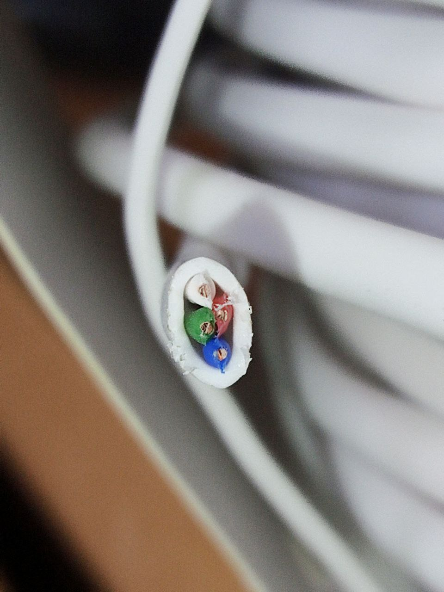
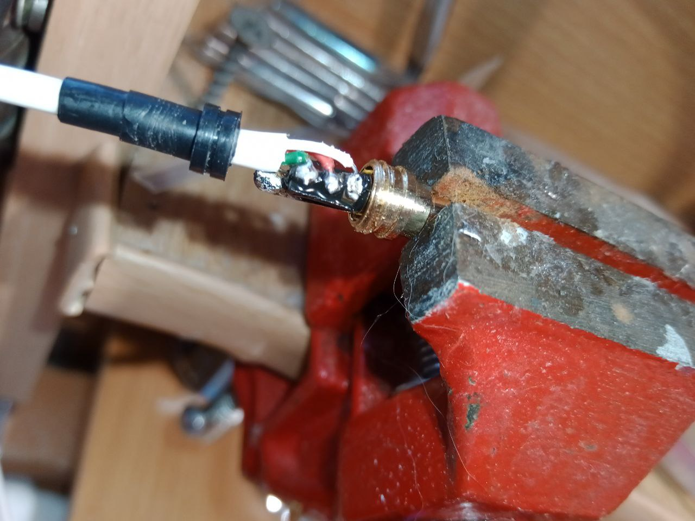
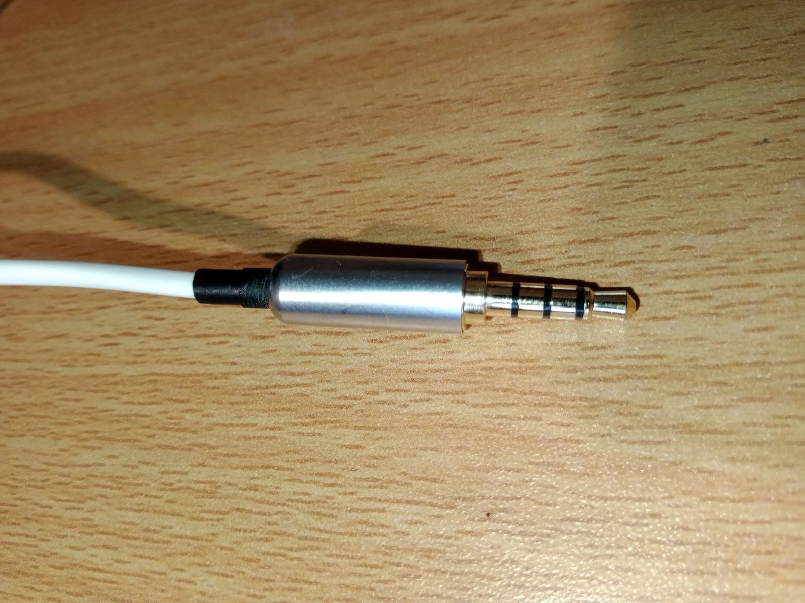

 4.4 и 5.4 с набором датчиков|482x482пкс]]

[WEGABOX](WEGABOX.md) поддерживает различные датчики и устройства. Датчики есть как цифровые так и аналоговые. Аналоговые датчики требуют калибровки на стороне [WEGA-SERVER](WEGA-SERVER.md). 

| Наименование | Тип | Порт | Описание |
| --- | --- | --- | --- |
| [Электрод ЕС/NTC](Электрод_ЕС_NTC.md) | аналоговый | EC | Комбинированный датчик для измерения удельной [электропроводности раствора](https://ru.wikipedia.org/wiki/%D0%AD%D0%BB%D0%B5%D0%BA%D1%82%D1%80%D0%BE%D0%BF%D1%80%D0%BE%D0%B2%D0%BE%D0%B4%D0%BD%D0%BE%D1%81%D1%82%D1%8C#%D0%AD%D0%BB%D0%B5%D0%BA%D1%82%D1%80%D0%BE%D0%BF%D1%80%D0%BE%D0%B2%D0%BE%D0%B4%D0%BD%D0%BE%D1%81%D1%82%D1%8C_%D1%80%D0%B0%D1%81%D1%82%D0%B2%D0%BE%D1%80%D0%BE%D0%B2) с термокомпенсацией. |
| [Электрод pH](pH.md) | аналоговый | BNC | Датчик (электрод) для измерения [водородного показателя](https://ru.wikipedia.org/wiki/%D0%92%D0%BE%D0%B4%D0%BE%D1%80%D0%BE%D0%B4%D0%BD%D1%8B%D0%B9_%D0%BF%D0%BE%D0%BA%D0%B0%D0%B7%D0%B0%D1%82%D0%B5%D0%BB%D1%8C) раствора |
| [AHT10/20/21](AHT10.md) | цифровой | I2C | Серия цифровых датчиков температуры и влажности воздуха |
| [AM2320](AM2320.md) | цифровой | I2C | Датчик температуры и влажности воздуха |
| [SDC30](SDC30.md) | цифровой | I2C | Датчик углекислого газа CO2, температуры и влажности |
| [CCS811](CCS811.md) | цифровой | I2C | Датчик качества воздуха CO2 и tVOC |
| [BMP280/BME280](BMP280_BME280.md) | цифровой | I2C | Серия цифровых датчиков давления и температуры воздуха |
| [DS18B20](DS18B20.md) | цифровой | 1-Wire | Датчик температуры раствора в зоне корней |
| [US025](US025.md) | цифровой | US | Ультразвуковой датчик расстояния для измерения уровня раствора |
| [HX710B](HX710B.md) | цифровой | US | Датчик уровня раствора через давление |
| [VL6180X](VL6180X.md) | цифровой | I2C/US | Лазерный датчик расстояния для измерения уровня раствора (только для малых высот до 20 см) |
| [VL53L0X](VL53L0X.md) | цифровой | I2C/US | Лазерный датчик расстояния для измерения уровня раствора |
| [GL5528](GL5528.md) | аналоговый | PR | аналоговый фоторезистор для измерения уровня освещенности |

## Общие принципы изготовления
[[Файл:Jack 3.5.png|мини|482x482пкс|[Jack 3.5 под пайку](https://aliexpress.ru/item/32948072892.html)]]

Все датчики кроме pH электрода необходимо соединить с [WEGABOX](WEGABOX.md). 

Для этого вам понадобится водонепроницаемый провод 4-х жильный и штекеры Jack 3.5 под пайку.

Коннекторы на [Aliexpress](https://aliexpress.ru/item/32948072892.html)

Пример кабеля в [Leroy Merlin](https://leroymerlin.ru/product/provod-oxion-kspv-4x04-50-m-gost-18549376)