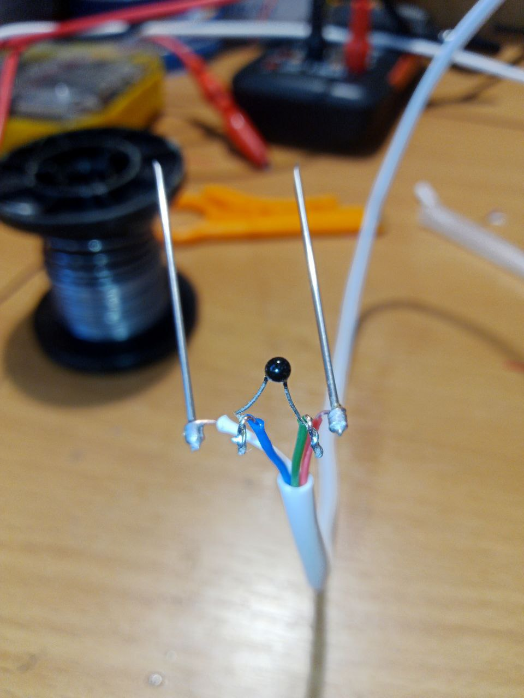
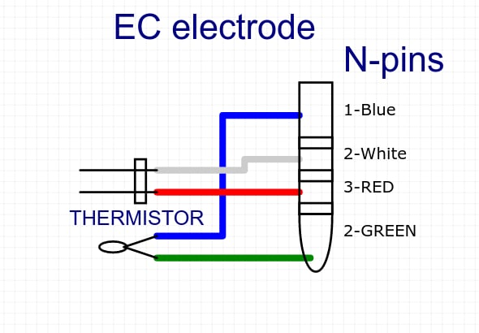
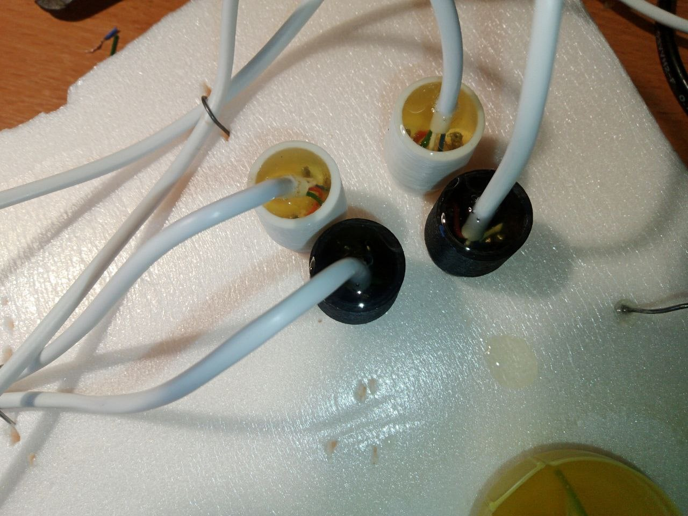
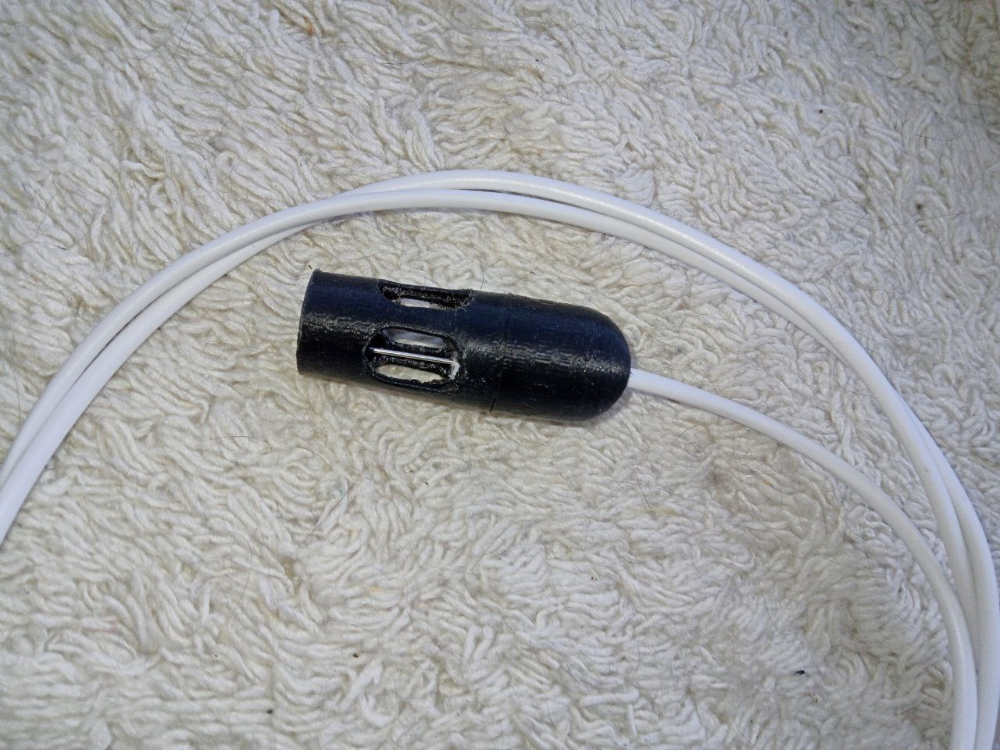

[назад к списку устройств](Список_поддерживаемых_датчиков.md)

[Калибровка NTC](Калибровка_NTC.md) (необходимо сделать перед калибровкой EC)

[Калибровка ЕС](Калибровка_ЕС.md)

Электрод ЕС изготовить самостоятельно, но возможно приобрести частично готовый. При этом надо понимать, что полностью готовые не продаются и все равно придется припаять Jack 3.5 и изготовить защитный кожух для контактов.
## Купить

Один из самых простых вариантов это купить готовый электрод/датчик. Необходимое условие, что бы он был с терморезистором. 

В зависимости от номинала терморезистора придется заменить один резистор на плате. Так же остается обязательным изготовление чехла на электрод для получения корректных данных. Плюс необходимо припаять штекер типа Jack 3.5 (4 контакта).

Вот несколько вариантов электродов, которые можно купить.

* [TDS Conductivity with NTC Temperature Sensor](https://www.aliexpress.us/item/2251832731993509.html)
* [TDS Conductivity NTC Sensor Measuring](https://www.aliexpress.us/item/3256802747111815.html)  

Если эти варианты не доступны, то попробуйте воспользоваться [поиском](https://www.aliexpress.com/w/wholesale-TDS-Conductivity-with-NTC-Temperature.html?catId=0&initiative_id=SB_20230629081751&SearchText=TDS+Conductivity+with+NTC+Temperature&spm=a2g0o.productlist.1000002.0)

## Изготовить
### Инструменты и материалы
Для изготовления электрода ЕС/NTC нам потребуется:

* Два медицинских шприца, а точнее иглы от них из нержавеющей медицинской стали
* Ортофосфорная кислота для пайки нержавеющей стали (ничем другим припаять не получится)
* [NTC](NTC.md) терморезистор
* Эпоксидная смола ЭПД без добавок
* Корпус электрода напечатанный на 3D принтере https://github.com/WEGA-project/wega-3d/tree/main/ec
* Кабель 4-х жильный
* Штекер типа Jack 3.5 (4 контакта)

### Процесс изготовления
* Сначала с помощью цельной иглы прочищаем печатные отверстия в корпусе электрода
* Откусываем от иглы посадочный переходник и наматываем виток к витку несколько оборотов провода
* Смачиваем место обмотки ортофосфорной кислотой и выжидаем 10-20 секунд припаиваем. После пайки желательно стереть остатки кислоты спиртом
*Припаиваем NTC обычным флюсом
*Вставляем иглы в отверстие корпуса электрода до упора, размещаем NTC между ними в самый низ так, чтобы контакты не соприкасались.
*Закрепляем электрод в вертикальном положении для заливки эпоксидной смолой.
*Проверяем позвонковой нет ли короткого замыкания между NTC и электронами EC
*Готовим эпоксидную смолу и заливаем так, чтобы общая изоляция провода оказалась утоплена в нее внутри корпуса
*Выжидаем так сутки, проверяем на КЗ и если все в порядке собираем корпус
*Припаиваем Jack 3.5

  
  
  
  
  
  
  
  
  
  
  
  
  
  
  
  

